# LinkedIn Post Generator

This tool analyzes a LinkedIn influencer's past posts and helps them create new posts that match their writing style.

**🔗 Live Demo:** [linkedin-post-generator-saisukanyakonijeti2005.streamlit.app](https://linkedin-post-generator-saisukanyakonijeti2005.streamlit.app)

Let's say someone is a LinkedIn influencer and needs help writing future posts. They can feed their past LinkedIn posts into this tool, and it will extract key topics. Then they can select the topic, length, and language, and use the Generate button to create a new post that matches their writing style.

## Technical Architecture

```mermaid
flowchart TD
    A[Raw LinkedIn Posts<br/>data/raw_posts.json] --> B[Stage 1: Preprocessing<br/>preprocess.py]
    B -->|LLM extracts| C[Line Count]
    B -->|LLM extracts| D[Language]
    B -->|LLM extracts| E[Tags]
    C & D & E --> F[Unify similar tags<br/>via LLM]
    F --> G[Processed Posts<br/>data/processed_posts.json]

    G --> H[Stage 2: Post Generation]
    I[User picks<br/>Topic / Length / Language] --> H
    H --> J[few_shot.py<br/>filters matching example posts]
    J --> K[post_generator.py<br/>builds prompt + few-shot examples]
    K --> L[LLM - Llama via Groq]
    L --> M[Generated LinkedIn Post]

    style A fill:#1e3a5f
    style G fill:#1e3a5f
    style M fill:#2d5016
    style L fill:#5f1e1e
```



1. **Stage 1:** Collect LinkedIn posts and extract Topic, Language, Length, etc. from them.
2. **Stage 2:** Use topic, language, and length to generate a new post. Past posts matching that specific topic, language, and length are used for few-shot learning to guide the LLM on writing style.

## Set-up

1. To get started, get an API key from [console.groq.com/keys](https://console.groq.com/keys). Inside `.env`, update the value of `GROQ_API_KEY` with the key you created.
2. Install the dependencies:
   ```
   pip install -r requirements.txt
   ```
3. Run the preprocessing step to generate `data/processed_posts.json`:
   ```
   python preprocess.py
   ```
4. Run the Streamlit app:
   ```
   streamlit run main.py
   ```

## Tech Stack

- **LLM:** Llama (via Groq)
- **Orchestration:** LangChain
- **Frontend:** Streamlit
- **Deployment:** Streamlit Community Cloud

---

*Based on the [codebasics GenAI Post Generator](https://github.com/codebasics/project-genai-post-generator) tutorial project.*
